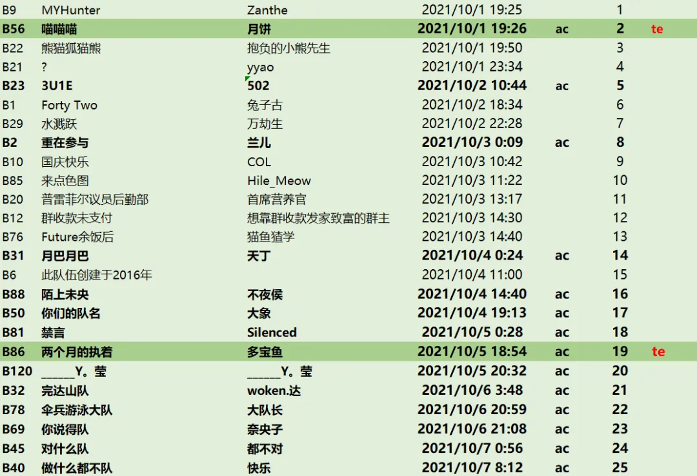

# Winfrid

本次活动共有191支队伍参赛，其中校内组70支，校外组121支，共有441位选手。最终有**20支校内组和25支校外组**完赛，而共有**2支校内组和2支校外组达成了True Ending\~**

<figure><figcaption></figcaption></figure>

校内组前三分别是**丸山下茨菇田樱小姐机关车专修队**（29小时35分钟）、**请输入你们的队名**（33小时8分钟）、**还没凑齐组员队**（33小时25分钟）。这三支队伍都达成了All Combo的成就（在完赛前完成全部小题）

值得一提的是，**还没凑齐组员队**也完成了True Ending的触发。另一支触发True Ending的队伍是**十三陵小丑队**，他们在解出Normal Ending前通过枚举误打误撞进了TE。造化弄人\~

<figure><figcaption></figcaption></figure>

校外组前三分别是**MYHunter**（11小时10分钟）、**喵喵喵**（11小时11分钟）、**还熊猫狐猫熊**（11小时35分钟），同时也是校内校外合榜的前三。MYHunter之前进度一直很快，但一直没有拿到首杀，最终在夜色的庇护下奇袭以不到一分钟的优势砍下第一。

不过，**喵喵喵**是比赛第一个拿到AC的小队，同时也是第一个解锁TE的小队！与此同时，**两个月的执着**也拿下了TE。

> Q：TE？
>
> A：在Ending的剧情里点击“阅读原文”即可——这是新时代的隐写术。

Puzzle and Key Universe这个名字是我们当时最早定下来的内容，Zero是后面整个剧情的一个楔子——我们想要让之后的剧情都发生在女主幻想的想象世界，也就是“谜和解的宇宙”中。

我们在报名问卷和零推提到了这个词组，但是最终的参赛群都是以Zero为标题，也是为了在最后finalmeta以一个之前有过印象的答案震惊大家。

不出意外的话，明年**应该还会在5-6月有一次puzzlehunt，应该会有网站，应该还是不出30题的体量，应该会比这次难，但依然会有充足的提示（甚至更充足）**，应该。再未来的事——虽然也可以构想很多，比如是一年两次还是一年一次——暂时还是不作构想了
