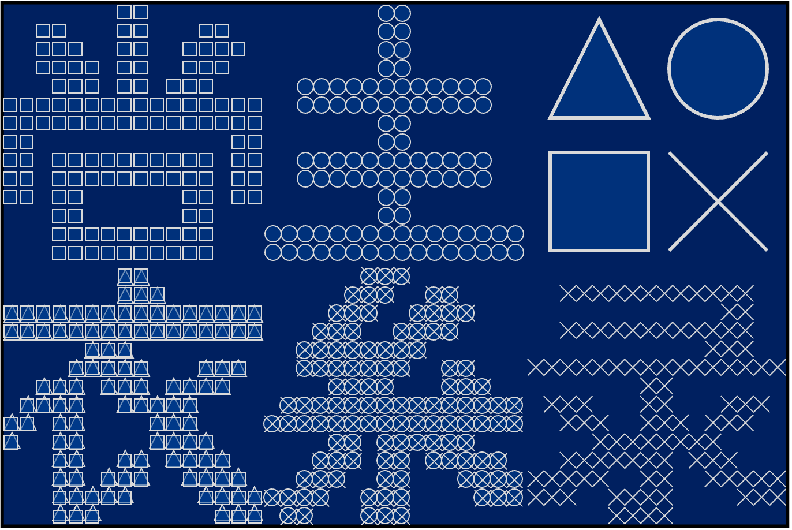

# 新游戏发布会

## 题面


[P\&KU2：新游戏发布会](https://pnku2.pkupuzzle.art/#/game/miyu/prob\_04)（需要注册与登录）


_PS上的拼图游戏？_ _这东西会有人买吗？_

## 答案

衣素裳绿

## 解析

很显然是拼图。直接拼起来可以得到如下图案：

接着根据右上角的四个图案，分别找到每个图案覆盖的区域。得到答案**“衣素裳绿”**。

## 作者

五月（设计与美工）

## 附言

### 五月

确实是填充题。但在出题阶段，我其实一直在关注每个答案字形上都具有哪些特点或者特性，比如说“槐阴添绿”这个答案一大特点就是四个字都是左右结构，而折纸的思路恰好能把这个结构用上。

而本题的答案也很有趣，四个汉字，但却能找出两组共享偏旁部首的字。这种小趣味，是我想传达给玩家的——不过我太菜了没传达出来那又是另一个问题了。
